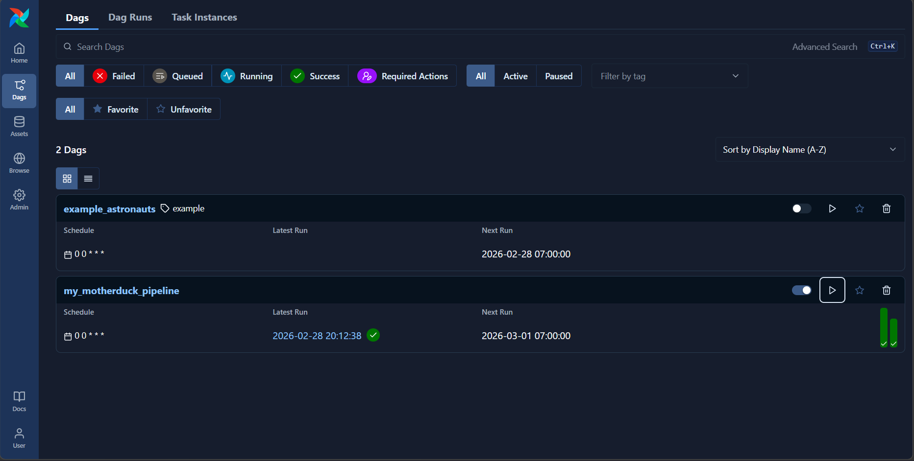
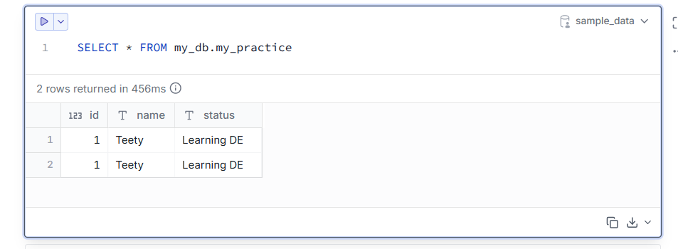
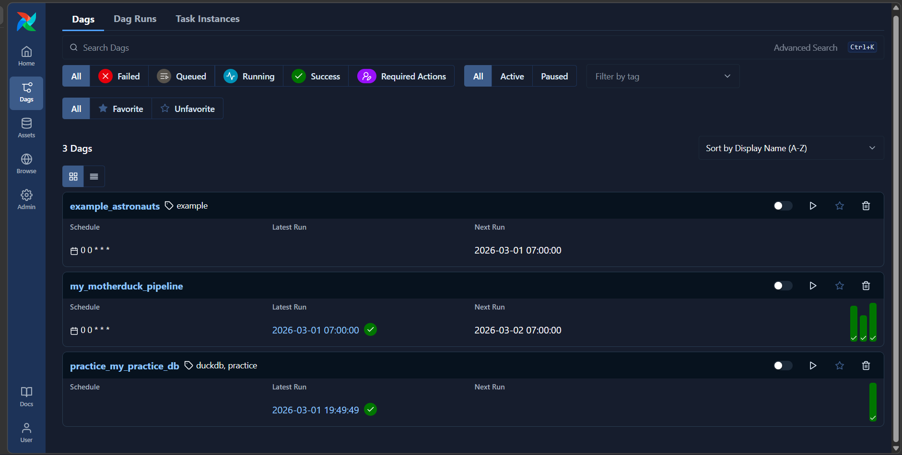
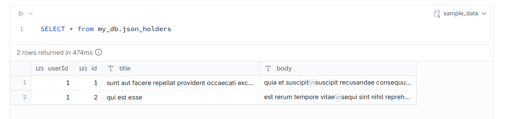

# Airflow + MotherDuck (Cloud)
```bash
winget install -e --id Astronomer.Astro

astro dev init
astro dev start
astro dev restart

mother_duck_api = "API_HERE"
```
# Airflow UI
test run pipline per daily <br>


# MotherDuck (on Cloud free)
test query data <br>

<br>

# Days to automate pipeline
<hr>
test extract data from api to pipeline into duckdb <br>

<br>
